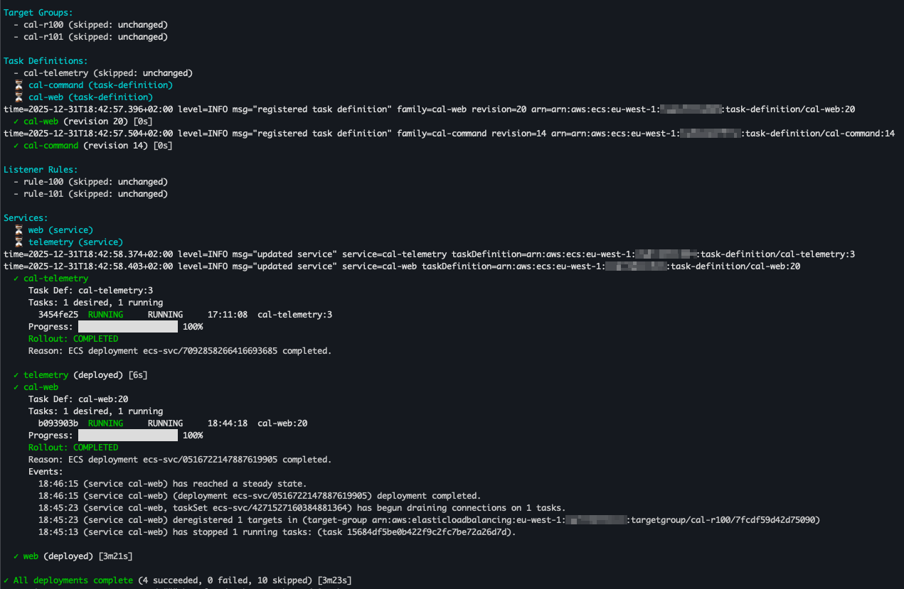

# ecsmate

ECS deployment management CLI for CI/CD. ecsmate renders desired state from CUE,
diffs it against live AWS resources, and applies changes with live tracking.

## Table of contents
- [Highlights](#highlights)
- [Requirements](#requirements)
- [IAM Permissions](#iam-permissions)
- [Build and run](#build-and-run)
- [CLI basics](#cli-basics)
  - [Global flags](#global-flags)
  - [Exit codes](#exit-codes)
  - [Commands](#commands)
- [How it works](#how-it-works)
- [Diff output (differ)](#diff-output-differ)
- [Apply tracker (tracker)](#apply-tracker-tracker)
- [Manifest format](#manifest-format)
  - [Task definitions](#task-definitions)
  - [Services](#services)
  - [Scheduled tasks](#scheduled-tasks)
  - [Ingress (ALB listener rules)](#ingress-alb-listener-rules)
- [Values and overrides](#values-and-overrides)
- [SSM parameter references](#ssm-parameter-references)
- [Secrets management](#secrets-management)
- [Examples](#examples)
- [Notes and limitations](#notes-and-limitations)

## Highlights
- Declarative manifests in [CUE] with values overlays and `--set` overrides.
- Diff output that groups resource changes and shows recreate reasons.
- Apply pipeline with live tracker (interactive TTY or log-friendly output).
- ECS services, task definitions, scheduled tasks, and ALB ingress support.
- Optional SSM parameter resolution with `{{ssm:/path}}` placeholders.
- Managed secrets with KMS envelope encryption and automatic SSM parameter sync.
- Built-in status, rollback, validate, and template commands.

## Requirements
- Go 1.25+ to build.
- AWS credentials with access to ECS, EventBridge Scheduler, ELBv2,
  Application Auto Scaling, IAM, CloudWatch Logs, SSM, KMS, and STS (as needed).

## Build and run
```bash
go build ./cmd/ecsmate
./ecsmate --help
```

You can also run directly:
```bash
go run ./cmd/ecsmate --help
```

## CLI basics
### Global flags
- `-m, --manifest`: manifest directory (default: `.`)
- `-f, --values`: values files (repeatable, merged in order)
- `--set`: override values with `key=value` (repeatable)
- `-c, --cluster`: ECS cluster name/ARN
- `-r, --region`: AWS region
- `--log-level`: `debug|info|warn|error`
- `--no-color`: disable ANSI colors
- `--no-ssm`: skip SSM resolution

### Exit codes
- `0` success/no diff
- `1` error
- `2` diff detected (diff command only)
- `3` rollout failed (apply/rollback)

### Commands
`diff`  
Show desired vs current state. Exit code `2` if changes are detected.

`apply`  
Apply the plan. Prompts for confirmation unless `--auto-approve` is set.
Flags:
- `--auto-approve`: skip interactive confirmation
- `--no-wait`: return after submitting changes
- `--timeout`: wait timeout for deployments (default 15m)
- `--log-lines`: task log lines on failure (`-1` all, `0` none, `N` limit)



`status`  
Show service status. Use `--watch` to stream updates.
Flags:
- `--service`: check a specific service (requires `--cluster`)
- `--watch`: refresh in a loop
- `--interval`: watch interval seconds
- `--events`: number of recent events per service

`rollback`  
Rollback a service to a previous task definition revision.
Flags:
- `--service`: service name (required)
- `--revision`: negative for relative (`-1` previous), positive for absolute
- `--list`: list available revisions
- `--limit`: number of revisions to list
- `--no-wait`: do not wait for deployment completion

`validate`  
Validate CUE syntax, schema constraints, and manifest content without AWS calls.

`template`  
Render the fully resolved manifest (YAML or JSON) without diffing/applying.
Flags:
- `-o, --output`: `yaml` (default) or `json`

`secrets`  
Manage encrypted secrets files using KMS envelope encryption.
Subcommands:
- `encrypt <file> --kms-arn <arn>`: encrypt a plaintext YAML file
- `decrypt <file>`: decrypt to stdout
- `set <file> <key> [--value <val>]`: set or update a secret (prompts if no value)
- `delete <file> <key>`: remove a secret from the file

## How it works
1. Loads all `.cue` files in the manifest directory plus `taskdefs/` and
   `values/` subdirectories.
2. Merges any `--values` files and applies `--set` overrides.
3. Resolves `{{ssm:...}}` placeholders (unless `--no-ssm`).
4. Loads and decrypts managed secrets (if configured).
5. Builds desired state and discovers current ECS/ALB/Scheduler resources.
6. Generates a plan and renders a diff.
7. Applies in order:
   - SSM parameters (managed secrets)
   - Log groups (from `awslogs` container configs with `createLogGroup: true`)
   - Target groups (ingress)
   - Task definitions
   - Listener rules (ingress)
   - ECS services
   - Scheduled tasks

Service names are automatically prefixed with the manifest `name` (if set),
unless already prefixed.

## Diff output ("differ")
The diff renderer groups changes by resource and shows a boxed, structured view.
It marks actions as Create/Update/Delete/Recreate and includes recreate reasons.

Notable behaviors:
- ECS-assigned defaults like `hostPort` are ignored if only present remotely.
- Unchanged `environment` entries are suppressed to reduce noise.

## Apply tracker ("tracker")
The tracker prints structured progress with sections and task statuses. In an
interactive TTY, it re-renders service deployment progress in place, including:
- rollout state and reasons
- old vs new task definition
- per-task status (RUNNING/PENDING/STOPPED)
- progress bar and recent events

In non-interactive output, it prints events and state changes as log lines.

## Manifest format
Manifests are defined in CUE. Import the schema from `pkg/cue`. The schema is
embedded in the binary, so ecsmate can be run from any directory without needing
access to the ecsmate source tree.

Basic shape:
```cue
import "github.com/x-qdo/ecsmate/pkg/cue:schema"

manifest: schema.#Manifest & {
  name: "myapp"
  taskDefinitions: { ... }
  services: { ... }
  scheduledTasks: { ... }
  ingress: { ... }
}
```

### Task definitions
Three types:
- `managed`: fully defined in CUE
- `merged`: override an existing task definition ARN
- `remote`: use a task definition ARN as-is

Managed example:
```cue
taskDefinitions: {
  web: {
    type: "managed"
    family: "myapp-web"
    cpu: "256"
    memory: "512"
    requiresCompatibilities: ["FARGATE"]
    containerDefinitions: [{
      name: "web"
      image: "123456789012.dkr.ecr.us-east-1.amazonaws.com/web:latest"
      portMappings: [{ containerPort: 80 }]
      logConfiguration: {
        logDriver: "awslogs"
        options: {
          awslogs-group: "/ecs/myapp/web"
          awslogs-region: "us-east-1"
          awslogs-stream-prefix: "ecs"
        }
        createLogGroup: true
        retentionInDays: 14
      }
    }]
  }
}
```

Long-running workers that intentionally exit after processing for a fixed time
can use the native ECS container restart policy instead of replacing the whole
task:

```cue
restartPolicy: {
  enabled: true
  restartAttemptPeriod: 60 // omit to use the ECS default of 300 seconds
  // ignoredExitCodes: [143] // these exit codes are not restarted
}
```

`restartAttemptPeriod` accepts 60–1800 seconds. `ignoredExitCodes` accepts up to
50 values in the range 0–255. To restart a worker after a normal time-limit exit,
do not include exit code `0` in `ignoredExitCodes`.

Merged example:
```cue
taskDefinitions: {
  api: {
    type: "merged"
    baseArn: "arn:aws:ecs:us-east-1:123456789012:task-definition/api:12"
    overrides: {
      cpu: "512"
      containerDefinitions: [{
        name: "api"
        image: "123456789012.dkr.ecr.us-east-1.amazonaws.com/api:v2"
      }]
    }
  }
}
```

Remote example:
```cue
taskDefinitions: {
  worker: {
    type: "remote"
    arn: "arn:aws:ecs:us-east-1:123456789012:task-definition/worker:42"
  }
}
```

### Services
```cue
services: {
  web: {
    cluster: "my-ecs-cluster"
    taskDefinition: "web"
    desiredCount: 2
    launchType: "FARGATE"
    networkConfiguration: {
      awsvpcConfiguration: {
        subnets: ["subnet-123", "subnet-456"]
        securityGroups: ["sg-123"]
        assignPublicIp: "DISABLED"
      }
    }
    deployment: {
      strategy: "rolling" // or "gradual"
      config: {
        minimumHealthyPercent: 50
        maximumPercent: 200
        circuitBreaker: { enable: true, rollback: true }
        alarms: ["my-alarm-name"]
        alarmRollback: true
      }
    }
  }
}
```

Deployment strategies:
- `rolling`: standard ECS update with deployment configuration.
- `gradual`: ECS-native staged rollout using `deployment.config.steps` with
  `percent` and `wait` (seconds).

`blue-green` and `canary` are present in the CUE schema but are not supported
by the executor; they will fail with an explicit error.

Gradual example:
```cue
deployment: {
  strategy: "gradual"
  config: {
    steps: [
      { percent: 25, wait: 60 },
      { percent: 50, wait: 60 },
      { percent: 75, wait: 60 },
      { percent: 100, wait: 0 },
    ]
  }
}
```

Auto scaling:
```cue
autoScaling: {
  minCapacity: 1
  maxCapacity: 10
  policies: [{
    name: "cpu"
    type: "TargetTrackingScaling"
    targetValue: 50
    predefinedMetric: "ECSServiceAverageCPUUtilization"
  }]
}
```

Service dependency ordering:
```cue
services: {
  web: { ... }
  worker: {
    dependsOn: ["web"]
  }
}
```

### Scheduled tasks
Scheduled tasks are created via EventBridge Scheduler. When scheduled tasks are
present, ecsmate ensures an EventBridge role exists for the scheduler.
```cue
scheduledTasks: {
  nightly: {
    taskDefinition: "cron"
    cluster: "my-ecs-cluster"
    taskCount: 1
    platformVersion: "1.4.0"
    group: "maintenance" // ECS task group
    schedule: {
      type: "cron"
      expression: "0 2 * * ? *"
    }
    networkConfiguration: {
      awsvpcConfiguration: {
        subnets: ["subnet-123"]
        securityGroups: ["sg-123"]
        assignPublicIp: "DISABLED"
      }
    }
    tags: [
      { key: "env", value: "prod" },
      { key: "team", value: "ops" },
    ]
    deadLetterConfig: {
      arn: "arn:aws:sqs:us-east-1:123456789012:dlq"
    }
    retryPolicy: {
      maximumEventAgeInSeconds: 300
      maximumRetryAttempts: 2
    }
  }
}
```

### Ingress (ALB listener rules)
Ingress rules generate target groups and listener rules.
```cue
ingress: {
  listenerArn: "arn:aws:elasticloadbalancing:..."
  vpcId: "vpc-123"
  rules: [{
    priority: 10
    host: "app.example.com"
    service: {
      name: "web"
      containerName: "web"
      containerPort: 80
    }
    healthCheck: { path: "/health", matcher: "200" }
  }]
}
```

## Values and overrides
Manifests commonly split defaults and environment-specific values under
`values/`. Files directly in `values/` (like `default.cue`, `_ssm.cue`) are
auto-loaded. Subdirectory files (`values/envs/*.cue`, `values/tenants/*.cue`)
must be explicitly provided with `-f`. Ad-hoc changes use `--set`.

### Making values overridable
To allow `--set` overrides, use CUE's default syntax (`type | *"default"`)
instead of concrete values:
```cue
// Overridable (recommended)
images: {
  tag: string | *"latest"      // --set images.tag=v2.0 works
  registry: string | *"ecr.aws"
}

// NOT overridable (concrete values cause conflicts)
images: {
  tag: "latest"                // --set images.tag=v2.0 fails
}
```

The `--set` flag uses CUE unification, which can only fill in or narrow
constraints. Concrete values like `tag: "latest"` are already fully specified
and cannot be changed. The default syntax `string | *"latest"` defines a
constraint (`string`) with a default (`*"latest"`) that can be overridden.

Examples:
```bash
ecsmate diff -m ./deploy -f values/staging.cue
ecsmate apply -m ./deploy --set images.tag=v1.2.3
ecsmate diff -m examples/cloudinsurance \
  -f examples/cloudinsurance/values/envs/stage.cue \
  -f examples/cloudinsurance/values/tenants/cal.cue \
  --set images.tag=20260111-r4
```

## SSM parameter references
Any string field can include `{{ssm:/path/to/param}}`. ecsmate resolves these
in batch via SSM (and splits StringList values on commas for subnets/security
groups). Use `--no-ssm` to keep placeholders intact.

Example:
```cue
cluster: "{{ssm:/myapp/prod/ecs/cluster_name}}"
```

## Secrets management
ecsmate provides built-in secrets management using KMS envelope encryption.
Secrets are encrypted locally and stored in version control, then synced to
SSM Parameter Store as SecureString parameters during apply.

### Encrypted secrets file
Create and manage encrypted secrets files:
```bash
# Create initial secrets file from plaintext YAML
echo "db_password: secret123" > secrets.yaml
ecsmate secrets encrypt secrets.yaml --kms-arn arn:aws:kms:us-east-1:123456789012:key/xxx
rm secrets.yaml  # remove plaintext

# View decrypted contents
ecsmate secrets decrypt secrets.enc.yaml

# Add or update a secret
ecsmate secrets set secrets.enc.yaml api_key --value "newkey123"
ecsmate secrets set secrets.enc.yaml api_key  # prompts for value

# Remove a secret
ecsmate secrets delete secrets.enc.yaml old_key
```

### Manifest configuration
Configure managed secrets in your manifest:
```cue
manifest: schema.#Manifest & {
  name: "myapp"
  secrets: {
    managed: {
      file: "secrets.enc.yaml"
      kmsKeyArn: "arn:aws:kms:us-east-1:123456789012:key/xxx"
      kmsKeyRegion: "us-east-1" // optional; defaults to deployment region
      ssmKmsKeyId: "alias/myapp-ssm" // optional; must be in the deployment region
      ssmPrefix: "/myapp/prod"
    }
  }
  // ...
}
```

`kmsKeyArn`/`kmsKeyRegion` identify the KMS key used to decrypt the encrypted
secrets file. `ssmKmsKeyId` controls the KMS key used by SSM Parameter Store for
SecureString encryption. If `ssmKmsKeyId` is omitted, ecsmate reuses `kmsKeyArn`
only when it is in the deployment region; otherwise it lets SSM use the
region-local AWS-managed key.

### Using secrets in containers
Reference managed secrets by key name in container definitions:
```cue
containerDefinitions: [{
  name: "api"
  image: "myapp:latest"
  environment: {
    APP_ENV: "production"
    LOG_LEVEL: "info"
  }
  secrets: {
    DB_PASSWORD: "db_password"      // key from managed secrets
    API_KEY: "api_key"              // resolved to SSM ARN automatically
  }
}]
```

During apply, ecsmate:
1. Creates/updates SSM SecureString parameters at `{ssmPrefix}/{key}`
2. Resolves secret key names to their SSM parameter ARNs
3. Task definitions reference the SSM ARNs (values never in task definition)

### External secrets
For secrets managed outside ecsmate (Secrets Manager, existing SSM params):
```cue
secrets: {
  external: {
    LEGACY_KEY: "arn:aws:secretsmanager:us-east-1:123456789012:secret:legacy"
  }
}
// Then reference in containers:
secrets: {
  LEGACY_KEY: "arn:aws:secretsmanager:..."  // use ARN directly
}
```

### Safety features
- SSM parameters are tagged with `ManagedBy=ecsmate`
- ecsmate refuses to overwrite parameters not managed by it
- Diff output shows hash changes, never actual secret values
- Orphan detection: removes SSM params under prefix that are no longer in secrets file

## Examples
Two sample manifests live under `examples/`:
- `examples/webapp`: web + worker services with scheduled cron task.
- `examples/cloudinsurance`: ingress rules, service discovery, and SSM-backed
  infrastructure values.

Try:
```bash
ecsmate validate -m examples/webapp
ecsmate diff -m examples/webapp -f examples/webapp/values/staging.cue
ecsmate template -m examples/cloudinsurance -o yaml
```

## Notes and limitations
- Service names are prefixed with `manifest.name` unless already prefixed.
- `blue-green` and `canary` strategies require CodeDeploy and are not supported
  by the executor.
- Log groups are only created when using `awslogs` with `createLogGroup: true`.
- Managed secrets require KMS encrypt/decrypt permissions and SSM write access.
- Environment and secrets use map syntax (`KEY: "value"`) not array syntax.

[CUE]: https://github.com/cue-lang/cue
